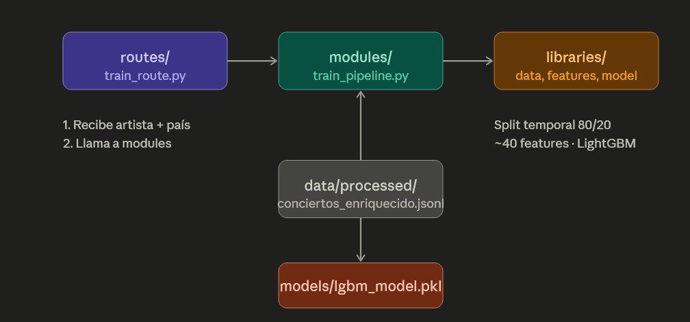

# Concerts predictor backend

## Inicializar
- uvicorn app.main:app --reload 

## Rutas
1. SCRAPING (ejecuta acción, sin input del usuario)
   GET /admin/scrape/concerts
   - Inicia el scraper
   - Guarda en JSONL
   - Response: { status: "completed", records: 1250, timestamp: "..." }

2. PROCESSING (ejecuta acción basado en datos existentes)
   GET /admin/process/intervals
   - Lee JSONL existente
   - Calcula intervals
   - Guarda en DB
   - Response: { status: "completed", intervals_calculated: 1250 }

3. MODEL TRAINING (ejecuta acción) (POST porque modifica cosas, ya veremos si se mantiene así)
   POST /admin/train/model
   - Lee datos procesados
   - Entrena modelo
   - Guarda modelo
   - Response: { status: "completed", model_version: "v1.2" }

4. PREDICTION (recibe datos, retorna resultado) ✅ ESTO SÍ ES POST
   POST /predict
   - Input: { artist: "Metallica", country: "Spain" }
   - Output: { prediction: "18 months", confidence: 0.85 }

## Grupos de música de los cuales podemos obtener información
1. Sum 41
2. Millencolin
3. Rancid
4. Blink 182
5. Rise Against
6. The Hotelier
7. Incubus
8. Silvestein
9. Oasis
10. The hellacopers
11. Green Day
12. Red Hot Chili Pepers
13. Swedish House Mafia
14. The Weekeend
15. Slayer
16. The Killers
17. Beady Eye
18. Linking Park
19. The Koxx
20. Radiohead
21. Limp Bizcuit
22. Lamb of God
23. Suicide Silence
24. Killswitch Engage
25. Bring me the Horizon
26. Halestorm
27. Meshuggah
28. Enter Shikari
29. gugudan
30. All That Remains
31. Dio
32. Bad City
33. A-ha
34. Our Last Night
35. Lynyrd Skynyrd
36. Death Cab For Cutie
37. Comeback kid
38. Stick To Your Guns
39. A day To Remember
40. Sugar Cult
41. Jimmy Eat World
42. The Story So Far
43. Pennywise
44. Taking Back Sunday
45. Zebrahead
46. Iron Maiden
47. The Goo Goo Dolls
48. Foals
49. Alkaline trio
50. My Chemical Romance
51. Coldplay
52. The Black Keys
53. Samiam
54. Donots
55. LP
56. Four Years Strong
57. Sublime
58. Kodaline
59. Twentyone Pilots
60. The Luminieers
61. Xavier Rudd
62. Pearl JAm
63. Jack Johnson
64. Mr scruff
65. The Stooges

## Implemetacion artist global features
Resumen de implementación
Archivos creados / modificados
app/libraries/date_utils.py — 3 funciones puras de fecha:

parsear_fecha(fecha_str) → datetime | None
dias_entre_fechas(fecha_anterior, fecha_actual) → int
años_entre_fechas(fecha_primera, fecha_actual) → float
app/libraries/window_utils.py — 4 funciones puras de ventana temporal (usan pd.Series internamente para operaciones vectorizadas):

conciertos_en_ventana(fechas, fecha_actual, dias) — cuenta con closed="left" lógico
dias_desde_ultimo_concierto(fechas, fecha_actual) → int | None
calcular_tendencia_actividad(fechas, fecha_actual) → ratio o None si 5-year window vacía
años_observados_artista(fechas, fecha_actual) → float | None
app/modules/features/artist_global_features.py — 2 funciones:

calcular_features_artista_global(registros_previos, fecha_actual) — calcula las 6 features para un registro
enriquecer_conciertos() — pipeline completo: carga el JSONL en DataFrame, agrupa por artista con groupby antes del bucle, filtra con fecha estrictamente anterior, guarda en data/processed/conciertos_enriquecido.jsonl
app/routes/data_pipeline.py — endpoint añadido:

POST /data-pipeline/process/enrich-features
app/modules/features/__init__.py — creado para hacer el subpaquete importable.

Garantías de no data leakage
Para cada registro solo se usan conciertos del mismo artista con fecha < fecha_actual (estrictamente anterior), incluyendo el manejo correcto de fechas iguales el mismo día.

Read C:\Users\black\AppData\Local\Temp\claude\c--master-ia-proyecto-final-backend\6676da6b-83f5-4835-a2fc-37a32dee3f3b\tasks\b0szzqvi0.output
El pipeline completó correctamente. 81.066 registros procesados, 0 errores de fecha.

Los primeros registros de "A Day To Remember" muestran exactamente el comportamiento esperado:

Primer concierto (2004-04-02): todas las features en None o 0 — sin historial previo
Segundo concierto (2004-06-03): 1 concierto en ventana de 1 año, 62 días desde el anterior, años_observados_artista: 0.17
Tercer concierto (2004-07-31): acumulación correcta de 2 conciertos previos
El archivo data/processed/conciertos_enriquecido.jsonl está listo con las 6 features calculadas sin data leakage.

## Estructura de entrenamiento de modelo

## features para entrenar el modelo
### Artist Global Features

Calculadas con los conciertos previos del artista en cualquier país.

- **conciertos_ultimo_año** — Conciertos en los 365 días previos a la fecha del registro.
- **conciertos_ultimos_3_años** — Conciertos en los 1095 días previos.
- **conciertos_ultimos_5_años** — Conciertos en los 1825 días previos.
- **dias_desde_ultimo_concierto_global** — Días desde el concierto más reciente del artista en cualquier país.
- **tendencia_actividad** — Ratio entre conciertos del último año y la media anual de los 5
anteriores. Detecta si el artista está acelerando o desacelerando su
actividad.
- **años_observados_artista** — Años desde el primer concierto del artista en el dataset hasta la
fecha del registro. Proxy de antigüedad e indicador de fiabilidad de las demás features.

### Artist Tour Features

Calculadas para detectar si el artista está en medio de una gira activa.

- **conciertos_artista_ultimos_30_dias** — Conciertos en los últimos 30 días. Si es alto, indica gira activa.
- **conciertos_artista_ultimos_90_dias** — Conciertos en los últimos 90 días.
- **en_gira_activa** — Binaria. `True` si `conciertos_ultimos_30_dias >= 3`.
- **dias_desde_concierto_anterior** — Gap en días con el concierto inmediatamente anterior del artista en cualquier país. Si es 1-3 días, está en mitad de un tour.
- **paises_distintos_ultimos_30_dias** — Número de países distintos visitados en los últimos 30 días. Confirma si es gira internacional.

### Artist × Country Features

Calculadas para el par artista + país concreto.

- **visitas_previas_al_pais** — Número de veces que el artista ha tocado en ese país antes de la fecha del registro.
- **es_primera_visita_observada** — Binaria. `True` si `visitas_previas_al_pais == 0`.
- **dias_desde_ultima_visita_pais** — Días desde el último concierto del artista en ese país.
- **gap_medio_pais** — Media de los gaps históricos entre visitas del artista a ese país (en días).
- **gap_mediano_pais** — Mediana de los gaps. Más robusta a outliers que la media.
- **gap_std_pais** — Desviación estándar de los gaps. Mide la regularidad de las visitas.
- **gap_min_pais** — Gap mínimo registrado entre visitas. Límite inferior del comportamiento histórico.
- **gap_max_pais** — Gap máximo registrado entre visitas. Límite superior del comportamiento histórico.
- **ultimo_gap_pais** — El gap más reciente registrado (entre las dos últimas visitas anteriores al registro).
- **tendencia_gap_pais** — Compara el último gap con la media histórica. Indica si los gaps se están acortando o alargando.
- **proporcion_visitas_pais** — `visitas_previas_al_pais / conciertos_totales_previos`. Mide qué tan importante es ese país para el artista.
- **rank_pais_para_artista** — Posición del país en el ranking de países más visitados por el
artista (1 = más visitado). Si está en el top 3, es probable visita
frecuente.

### Country Global Features

Calculadas considerando todos los artistas del dataset para ese país.

- **paises_unicos_visitados_total** — Países únicos visitados por el artista hasta la fecha del registro.
- **paises_unicos_visitados_ultimos_3_años** — Países únicos visitados en los 1095 días previos.
- **paises_unicos_visitados_ultimos_5_años** — Países únicos visitados en los 1825 días previos.
- **ciudades_unicas_ultimos_5_años** — Ciudades únicas visitadas en los 1825 días previos.
- **ratio_paises_conciertos_5y** — `países_únicos / conciertos_totales` en los últimos 5 años. Distingue giras distribuidas de giras concentradas en pocos países.
- **conciertos_totales_pais_previos** — Total de conciertos de todos los artistas del dataset en ese país antes de la fecha. Proxy del tamaño del mercado.
- **gap_medio_global_pais** — Gap medio entre visitas a ese país considerando todos los artistas.
Captura cada cuánto vuelven los artistas en general a ese país.

### Context Features

Calculadas a partir de la fecha del registro, sin necesidad de historial.

- **estacion** — Estación del año en la fecha del registro. Categórica: `invierno`, `primavera`, `verano`, `otoño`.
- **es_post_covid** — Binaria. `True` si `fecha > 2022-01-01`.
- **es_periodo_covid** — Binaria. `True` si `fecha` está entre `2020-03` y `2021-12`. Permite al modelo tratar ese período de forma separada.